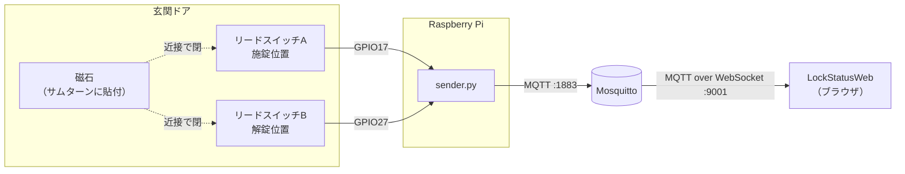

# LockStatusSensor

玄関のサムターンの位置をリードスイッチ2個で読み取り、施錠状態を MQTT に publish する常駐スクリプト。

## 全体構成



publish するトピックは2つ。

| トピック | 内容 | retain | 送信者 |
| --- | --- | --- | --- |
| `lock/status` | `{"state": "locked" \| "unlocked" \| "unknown", "ts": <epoch秒>}` | あり | sender.py |
| `lock/availability` | `online` / `offline` | あり | online は sender.py、offline は LWT でブローカー |

- **retain を付ける理由**: ブラウザは常時接続していない。retain がないと、接続した瞬間に次の状態変化が起きるまで何も表示できない。
- **availability を分ける理由**: 「今も施錠中」と「施錠中のまま送信が止まった」を受信側が区別するため。これがないと、センサーが死んだ瞬間の状態が永久に正しく見えてしまう。

## センサーの選定

**リードスイッチ2個 + 磁石1個**を使う。

サムターンに磁石を1個貼り、施錠位置と解錠位置それぞれに対向するようリードスイッチを固定側へ配置する。磁石が近づくと接点が閉じる。

なぜこの構成か:

- **ドアセンサー（枠に付ける開閉検知）では駄目**。あれが分かるのは「ドアが閉まっているか」であって「施錠されているか」ではない。閉まっているが施錠していない状態を検知できないので、目的を満たさない。
- **2個使うのは「解錠」と「異常」を区別するため**。1個だと、磁石が落ちた・断線した・サムターンが途中で止まっている、のすべてが「施錠位置ではない」に潰れる。施錠されていないものを「解錠」と断定するより、「不明」と出したほうが安全側に倒れる。
- **非接触なので摩耗しない**。マイクロスイッチでデッドボルトの突出を見る方法もあり検知としては確実だが、ドア枠側の加工が大きく、接点も摩耗する。
- **GPIO に直結できる**。内部プルアップを使えば外付け部品ゼロ、消費電力も実質ゼロ。ホール素子（A3144 等）でも同じことはできるが、電源配線が増えるだけで、この用途では利点がない。

接点の組み合わせと判定:

| 施錠位置A | 解錠位置B | 判定 | 想定される状況 |
| --- | --- | --- | --- |
| 閉 | 開 | `locked` | 施錠 |
| 開 | 閉 | `unlocked` | 解錠 |
| 開 | 開 | `unknown` | 中間位置、磁石の脱落、断線 |
| 閉 | 閉 | `unknown` | 配線ミス、磁石の位置ずれ |

## 配線

Raspberry Pi の内部プルアップを使うので、抵抗は不要。

```
GPIO17 ---- リードスイッチA（施錠位置） ---- GND
GPIO27 ---- リードスイッチB（解錠位置） ---- GND
```

磁石が近い = 接点が閉じる = ピンが GND に落ちて LOW。ピン番号は `config.json` の `gpio.locked_pin` / `gpio.unlocked_pin` で変更できる（BCM 番号）。

チャタリングは `gpio.bounce_seconds`（既定 50ms）で吸収している。

## セットアップ

```bash
pip install -r requirements.txt
cp config.example.json config.json   # 初回起動時に自動でコピーもされる
```

`config.json` の `mqtt.broker` を自分のブローカーのアドレスに変更する。

### MQTT ブローカー

Mosquitto に、センサー用の 1883 とブラウザ用の WebSocket 9001 の両方を開ける必要がある。**ブラウザは 1883 の生の MQTT には接続できない。** `mosquitto.example.conf` を参照。

```bash
sudo cp mosquitto.example.conf /etc/mosquitto/conf.d/lockstatus.conf
sudo systemctl restart mosquitto
```

## 実行

```bash
python sender.py
```

常駐させる場合は systemd から起動する。接続断は自動で再接続し、再接続時には現在の状態を送り直す。

## GPIO のない環境で動かす

`config.json` の `gpio.mock` を `true` にすると、`mock_state` ファイルの中身をそのまま状態として読む。

```bash
echo locked   > mock_state   # 施錠
echo unlocked > mock_state   # 解錠
rm mock_state                # 不明（磁石脱落相当）
```

Web 側の表示確認はこれで足りる。

## テスト

```bash
pytest
```

状態判定（特に「両方開」「両方閉」を `unknown` に倒す部分）を検証している。

## 設定項目

| キー | 既定値 | 説明 |
| --- | --- | --- |
| `mqtt.broker` | `192.168.3.13` | ブローカーのアドレス |
| `mqtt.port` | `1883` | ブローカーのポート |
| `mqtt.topic` | `lock/status` | 状態を送るトピック |
| `mqtt.availability_topic` | `lock/availability` | 死活を送るトピック |
| `mqtt.client_id` | `lock_sensor` | クライアントID（**他と重複させない**。重複すると相互に切断し合う） |
| `mqtt.username` / `mqtt.password` | `null` | 認証を有効にした場合に設定 |
| `gpio.mock` | `false` | GPIO を使わずファイルから読む |
| `gpio.locked_pin` | `17` | 施錠位置スイッチの BCM ピン番号 |
| `gpio.unlocked_pin` | `27` | 解錠位置スイッチの BCM ピン番号 |
| `gpio.bounce_seconds` | `0.05` | チャタリング吸収時間 |
| `poll_seconds` | `1.0` | 接点を読む間隔 |
| `heartbeat_seconds` | `60` | 変化がなくても送り直す間隔 |

## 未対応

- **認証・TLS**: LAN 内前提で `allow_anonymous true` のまま。扱っているのは物理的な施錠情報なので、外に出すなら必須。
- **電源断の検知**: Pi ごと落ちた場合は LWT で `offline` になるが、ブローカー自体が落ちた場合は Web 側から区別できない。

## ライセンス

MIT
