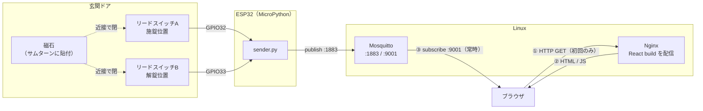

# LockStatusSensor

玄関のサムターンの位置をリードスイッチ2個で読み取り、施錠状態を MQTT に publish する ESP32 用ファームウェア（MicroPython）。

## 全体構成



ブラウザは Nginx から画面を1回受け取ったあと、状態は MQTT over WebSocket でだけ受け取る。HTTP で状態を取りにいくことはない。

publish するトピックは2つ。

| トピック | 内容 | retain | 送信者 |
| --- | --- | --- | --- |
| `lock/status` | `{"state": "locked" \| "unlocked" \| "unknown", "ts": <Unix epoch秒>}` | あり | sender.py |
| `lock/availability` | `online` / `offline` | あり | online は sender.py、offline は LWT でブローカー |

- **retain を付ける理由**: ブラウザは常時接続していない。retain がないと、接続した瞬間に次の状態変化が起きるまで何も表示できない。
- **availability を分ける理由**: 「今も施錠中」と「施錠中のまま送信が止まった」を受信側が区別するため。これがないと、センサーが死んだ瞬間の状態が永久に正しく見えてしまう。
- **`ts` は NTP 同期できたときだけ付く**。ESP32 の時計は電源投入時 2000-01-01 から始まるので、同期前の時刻を送ると「最終更新: 2000年」という嘘になる。付かない場合、Web 側は「時刻未同期」と表示する。

## 電源について（設計上の制約）

**このファームウェアは常時給電を前提にしている。ディープスリープは使えない。**

スリープすると MQTT 接続が切れ、ブローカーが LWT で `offline` を流す。つまり寝るたびに Web 側が「センサーが応答していません」になる。電池駆動にしたい場合は `lock/availability` による死活監視を捨て、`ts` の鮮度判定に設計ごと切り替える必要がある（Web 側の変更も伴う）。

## センサーの選定

**リードスイッチ2個 + 磁石1個**を使う。

サムターンに磁石を1個貼り、施錠位置と解錠位置それぞれに対向するようリードスイッチを固定側へ配置する。磁石が近づくと接点が閉じる。

なぜこの構成か:

- **ドアセンサー（枠に付ける開閉検知）では駄目**。あれが分かるのは「ドアが閉まっているか」であって「施錠されているか」ではない。閉まっているが施錠していない状態を検知できないので、目的を満たさない。
- **2個使うのは「解錠」と「異常」を区別するため**。1個だと、磁石が落ちた・断線した・サムターンが途中で止まっている、のすべてが「施錠位置ではない」に潰れる。施錠されていないものを「解錠」と断定するより、「不明」と出したほうが安全側に倒れる。
- **非接触なので摩耗しない**。マイクロスイッチでデッドボルトの突出を見る方法もあり検知としては確実だが、ドア枠側の加工が大きく、接点も摩耗する。
- **GPIO に直結できる**。内部プルアップを使えば外付け部品ゼロ。

接点の組み合わせと判定:

| 施錠位置A | 解錠位置B | 判定 | 想定される状況 |
| --- | --- | --- | --- |
| 閉 | 開 | `locked` | 施錠 |
| 開 | 閉 | `unlocked` | 解錠 |
| 開 | 開 | `unknown` | 中間位置、磁石の脱落、断線 |
| 閉 | 閉 | `unknown` | 配線ミス、磁石の位置ずれ |

## 配線

ESP32 の内部プルアップを使うので、抵抗は不要。

```
GPIO32 ---- リードスイッチA（施錠位置） ---- GND
GPIO33 ---- リードスイッチB（解錠位置） ---- GND
```

磁石が近い = 接点が閉じる = ピンが GND に落ちて `value() == 0`。

### ピンを変えるときの注意

`config.json` の `gpio.locked_pin` / `gpio.unlocked_pin` で変更できるが、ESP32 では**使ってはいけないピンがある**。

| ピン | 可否 |
| --- | --- |
| **GPIO32 / GPIO33** | **推奨。** 内部プルアップあり、起動に影響しない |
| GPIO6–11 | **不可。** 内蔵フラッシュに接続されている |
| GPIO0 / 2 / 12 / 15 | **避ける。** 起動時の strapping ピン。リードスイッチが閉じたまま電源を入れると起動しなくなる |
| GPIO34–39 | **避ける。** 入力専用で**内部プルアップがない**。使うなら 10kΩ のプルアップ抵抗を外付けする |

チャタリングは `gpio.bounce_ms`（既定 50ms）で吸収している。gpiozero の `bounce_time` に相当するものが MicroPython の `Pin` にないため、`lock_sensor.Debounced` が自前で行う。

## セットアップ

### 1. ESP32 に MicroPython を書き込む

[micropython.org/download/esp32](https://micropython.org/download/esp32/) から `.bin` を取得して書き込む。

```bash
pip install esptool mpremote
esptool.py --chip esp32 erase_flash
esptool.py --chip esp32 --baud 460800 write_flash -z 0x1000 ESP32_GENERIC-<version>.bin
```

### 2. MQTT ライブラリを入れる

`umqtt.simple` は標準ファームウェアに含まれないので、端末側で取得する。

```bash
mpremote mip install umqtt.simple
```

### 3. 設定ファイルを作る

```bash
cp config.example.json config.json
```

`config.json` の `wifi.ssid` / `wifi.password` と `mqtt.broker` を自分の環境に合わせる。**このファイルには Wi-Fi のパスワードが入るので、`.gitignore` 済み。コミットしないこと。**

### 4. 転送する

```bash
mpremote cp lock_sensor.py net.py sender.py main.py check_wiring.py config.json :
```

`main.py` があるので、以降は電源を入れるだけで起動する。

### 5. MQTT ブローカー

Mosquitto に、ESP32 用の 1883 とブラウザ用の WebSocket 9001 の両方を開ける必要がある。**ブラウザは 1883 の生の MQTT には接続できない。** `mosquitto.example.conf` を参照。

```bash
sudo cp mosquitto.example.conf /etc/mosquitto/conf.d/lockstatus.conf
sudo systemctl restart mosquitto
```

## 取り付け前に — 位置出し

リードスイッチを固定する前に、`check_wiring.py` を走らせたまま磁石を手に持って近づけ、**どの距離・どの向きで閉じるか**を実測する。

```bash
mpremote run check_wiring.py
```

```
A=GPIO32  B=GPIO33
A=開  B=開  -> unknown
A=閉  B=開  -> locked
```

ここを飛ばすと、動かないときに原因が配置なのか配線なのかコードなのか切り分けられない。

## ログを見る

```bash
mpremote repl
```

## テスト

状態判定とチャタリング吸収は、ESP32 なしで開発機で検証できる。`lock_sensor.py` は `machine` を `GpioLockSensor.__init__` の中でしか import しないため、CPython からそのまま読める。

```bash
pip install -r requirements-dev.txt
pytest
```

MicroPython の構文互換は `mpy-cross` で確認できる。

```bash
pip install mpy-cross
python -m mpy_cross sender.py -o /tmp/sender.mpy
```

## GPIO のない環境で動かす

`config.json` の `gpio.mock` を `true` にすると、`mock_state` ファイルの中身をそのまま状態として読む。

```bash
echo locked   > mock_state   # 施錠
echo unlocked > mock_state   # 解錠
rm mock_state                # 不明（磁石脱落相当）
```

## 設定項目

| キー | 既定値 | 説明 |
| --- | --- | --- |
| `wifi.ssid` / `wifi.password` | — | 接続先の Wi-Fi（2.4GHz のみ） |
| `mqtt.broker` | `192.168.1.10` | ブローカーのアドレス |
| `mqtt.port` | `1883` | ブローカーのポート |
| `mqtt.topic` | `lock/status` | 状態を送るトピック |
| `mqtt.availability_topic` | `lock/availability` | 死活を送るトピック |
| `mqtt.client_id` | `lock_sensor` | クライアントID（**他と重複させない**。重複すると相互に切断し合い、LWT が誤発火する） |
| `mqtt.username` / `mqtt.password` | `null` | 認証を有効にした場合に設定 |
| `mqtt.keepalive_seconds` | `180` | `heartbeat_seconds` の 2 倍以上にすること。下回ると、変化がない間にブローカーから切断される |
| `gpio.mock` | `false` | GPIO を使わずファイルから読む |
| `gpio.locked_pin` | `32` | 施錠位置スイッチのピン番号 |
| `gpio.unlocked_pin` | `33` | 解錠位置スイッチのピン番号 |
| `gpio.bounce_ms` | `50` | チャタリング吸収時間 |
| `poll_seconds` | `0.2` | 接点を読む間隔 |
| `heartbeat_seconds` | `60` | 変化がなくても送り直す間隔 |

## 設計上の割り切り

- **QoS は 0**。`umqtt` の QoS 1 はブローカーが応答しないとソケット待ちで止まり、ドアに付けた端末では復帰できなくなる。代わりに retain と heartbeat で届かせている。最悪ケースでは heartbeat 1 回ぶん（既定 60 秒）表示が古くなり、その後 keepalive 切れで LWT が飛んで「不明」に落ちる。
- **認証・TLS は未対応**。LAN 内前提で `allow_anonymous true` のまま。扱っているのは物理的な施錠情報なので、外に出すなら必須。
- **外から強い磁石を当てられると誤検知する**。玄関の外側からドア越しに磁石を近づけられる構造なら、この表示は「施錠されている証明」にはならない。鍵の代わりに使わないこと。

## ライセンス

MIT
